# Plan de Pruebas Sprint 01 — RBAC con Permisos Granulares (Frontend)

**Proyecto:** MURICSyncFront  
**Fecha:** 2026-06-08  
**Rama:** `rhenao-sprint04`  
**Sprint:** 01  
**Módulo:** RBAC  
**Tester:** Rolando Henao  

---

## Tabla de Contenido

- [Plan de Pruebas Sprint 01 — RBAC con Permisos Granulares (Frontend)](#plan-de-pruebas-sprint-01--rbac-con-permisos-granulares-frontend)
  - [Tabla de Contenido](#tabla-de-contenido)
  - [Alcance](#alcance)
  - [Precondiciones](#precondiciones)
  - [Casos de Prueba](#casos-de-prueba)
    - [CP-RBAC-01 — Login incluye permisos en el contexto](#cp-rbac-01--login-incluye-permisos-en-el-contexto)
      - [Pasos CP01](#pasos-cp01)
      - [Resultado esperado CP01](#resultado-esperado-cp01)
      - [Evidencias CP01](#evidencias-cp01)
      - [Estado CP01](#estado-cp01)
    - [CP-RBAC-02 — Menú solo muestra ítems permitidos (ADMIN)](#cp-rbac-02--menú-solo-muestra-ítems-permitidos-admin)
      - [Pasos CP02](#pasos-cp02)
      - [Resultado esperado CP02](#resultado-esperado-cp02)
      - [Evidencias CP02](#evidencias-cp02)
      - [Estado CP02](#estado-cp02)
  - [CP-RBAC-03 — Menú NO muestra ítems no permitidos (OPERADOR)](#cp-rbac-03--menú-no-muestra-ítems-no-permitidos-operador)
    - [Pasos CP03](#pasos-cp03)
    - [Resultado esperado CP03](#resultado-esperado-cp03)
      - [Evidencias CP03](#evidencias-cp03)
      - [Estado CP03](#estado-cp03)
  - [CP-RBAC-04 — Acceso directo a ruta sin permiso redirige](#cp-rbac-04--acceso-directo-a-ruta-sin-permiso-redirige)
    - [Pasos CP04](#pasos-cp04)
    - [Resultado esperado CP04](#resultado-esperado-cp04)
      - [Evidencias CP04](#evidencias-cp04)
      - [Estado CP04](#estado-cp04)
  - [CP-RBAC-05 — ListRoles carga y muestra roles correctamente](#cp-rbac-05--listroles-carga-y-muestra-roles-correctamente)
    - [Pasos CP05](#pasos-cp05)
    - [Resultado esperado CP05](#resultado-esperado-cp05)
      - [Evidencias CP05](#evidencias-cp05)
      - [Estado CP05](#estado-cp05)
  - [CP-RBAC-06 — Crear un nuevo rol](#cp-rbac-06--crear-un-nuevo-rol)
    - [Pasos CP06](#pasos-cp06)
    - [Resultado esperado CP06](#resultado-esperado-cp06)
      - [Evidencias CP06](#evidencias-cp06)
      - [Estado CP06](#estado-cp06)
  - [CP-RBAC-07 — Asignar permisos a un rol](#cp-rbac-07--asignar-permisos-a-un-rol)
    - [Pasos CP07](#pasos-cp07)
    - [Resultado esperado CP07](#resultado-esperado-cp07)
      - [Evidencias CP07](#evidencias-cp07)
      - [Estado CP07](#estado-cp07)
  - [CP-RBAC-08 — Editar un rol](#cp-rbac-08--editar-un-rol)
    - [Pasos CP08](#pasos-cp08)
    - [Resultado esperado CP08](#resultado-esperado-cp08)
      - [Evidencias CP08](#evidencias-cp08)
      - [Estado CP08](#estado-cp08)
  - [CP-RBAC-09 — Eliminar un rol sin usuarios](#cp-rbac-09--eliminar-un-rol-sin-usuarios)
    - [Pasos CP09](#pasos-cp09)
    - [Resultado esperado CP09](#resultado-esperado-cp09)
      - [Evidencias CP09](#evidencias-cp09)
      - [Estado CP09](#estado-cp09)
  - [CP-RBAC-10 — Intentar eliminar un rol con usuarios asignados falla](#cp-rbac-10--intentar-eliminar-un-rol-con-usuarios-asignados-falla)
    - [Pasos CP10](#pasos-cp10)
    - [Resultado esperado CP10](#resultado-esperado-cp10)
      - [Evidencias CP10](#evidencias-cp10)
      - [Estado CP10](#estado-cp10)
  - [CP-RBAC-11 — Intentar eliminar un rol predefinido falla](#cp-rbac-11--intentar-eliminar-un-rol-predefinido-falla)
    - [Pasos CP11](#pasos-cp11)
    - [Resultado esperado CP11](#resultado-esperado-cp11)
      - [Evidencias CP11](#evidencias-cp11)
      - [Estado CP11](#estado-cp11)
  - [CP-RBAC-12 — ListPermissions carga y muestra permisos](#cp-rbac-12--listpermissions-carga-y-muestra-permisos)
    - [Pasos CP12](#pasos-cp12)
    - [Resultado esperado CP12](#resultado-esperado-cp12)
      - [Evidencias CP12](#evidencias-cp12)
      - [Estado CP12](#estado-cp12)
  - [CP-RBAC-13 — Crear un nuevo permiso](#cp-rbac-13--crear-un-nuevo-permiso)
    - [Pasos CP13](#pasos-cp13)
    - [Resultado esperado CP13](#resultado-esperado-cp13)
      - [Evidencias CP13](#evidencias-cp13)
      - [Estado CP13](#estado-cp13)
  - [CP-RBAC-14 — El código del permiso es de solo lectura en edición](#cp-rbac-14--el-código-del-permiso-es-de-solo-lectura-en-edición)
    - [Pasos CP14](#pasos-cp14)
    - [Resultado esperado CP14](#resultado-esperado-cp14)
      - [Evidencias CP14](#evidencias-cp14)
      - [Estado CP14](#estado-cp14)
  - [CP-RBAC-15 — Eliminar permiso sin roles asignados](#cp-rbac-15--eliminar-permiso-sin-roles-asignados)
    - [Pasos CP15](#pasos-cp15)
    - [Resultado esperado CP15](#resultado-esperado-cp15)
      - [Evidencias CP15](#evidencias-cp15)
      - [Estado CP15](#estado-cp15)
  - [CP-RBAC-16 — Intentar eliminar permiso con roles asignados falla](#cp-rbac-16--intentar-eliminar-permiso-con-roles-asignados-falla)
    - [Pasos CP16](#pasos-cp16)
    - [Resultado esperado CP16](#resultado-esperado-cp16)
      - [Evidencias CP16](#evidencias-cp16)
      - [Estado CP16](#estado-cp16)
  - [CP-RBAC-17 — Código de permiso duplicado es rechazado](#cp-rbac-17--código-de-permiso-duplicado-es-rechazado)
    - [Pasos CP17](#pasos-cp17)
    - [Resultado esperado CP17](#resultado-esperado-cp17)
      - [Evidencias CP17](#evidencias-cp17)
      - [Estado CP17](#estado-cp17)
- [Pruebas de Regresión](#pruebas-de-regresión)
  - [CR-RBAC-01 — Funcionalidad existente no se rompe](#cr-rbac-01--funcionalidad-existente-no-se-rompe)
    - [Pasos](#pasos)
    - [Resultado esperado](#resultado-esperado)
  - [CR-RBAC-02 — Login/Logout funciona correctamente](#cr-rbac-02--loginlogout-funciona-correctamente)
    - [Pasos](#pasos-1)
    - [Resultado esperado](#resultado-esperado-1)

---

## Alcance

Verificar que el frontend consume correctamente los permisos granulares del backend, controla el acceso a pantallas y funciones según el permiso del usuario, y que las pantallas de gestión de roles y permisos operan correctamente.

---

## Precondiciones

- Backend actualizado con migraciones del sprint01.  
- Roles existentes: `ADMIN`, `OPERADOR`, `CONSULTA`, `SEGURIDAD`.  
- Permisos sembrados:  
  `params.read`, `params.write`, `cargas.read`, `cargas.write`,  
  `usuarios.read`, `usuarios.write`, `usuarios.unlock`,  
  `roles.manage`, `seguridad.manage`.  
- Usuarios de prueba:  
  - `admin@prueba.com` → ADMIN  
  - `operador@prueba.com` → OPERADOR  
  - `consulta@test.com` → CONSULTA  

---

## Casos de Prueba

---

### CP-RBAC-01 — Login incluye permisos en el contexto

**Objetivo:**  
Verificar que tras el login el usuario tenga los permisos en su contexto.

#### Pasos CP01

1. Inicia sesión con `admin@prueba.com`.  
2. Abre DevTools → Application → LocalStorage.  
3. Busca la clave donde se guarda el usuario (ej. `muric_user`).  

#### Resultado esperado CP01

- El objeto del usuario en LocalStorage incluye el campo `permissions`.  
- El array contiene al menos: `"params.read"`, `"roles.manage"`, `"seguridad.manage"`.  

#### Evidencias CP01

1. Antes de Login
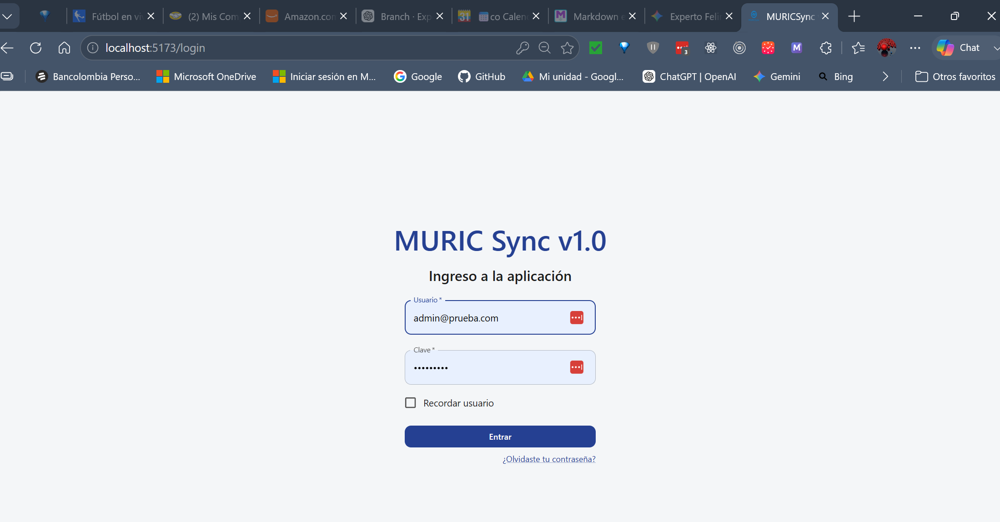
2. LocalStorage con permisos
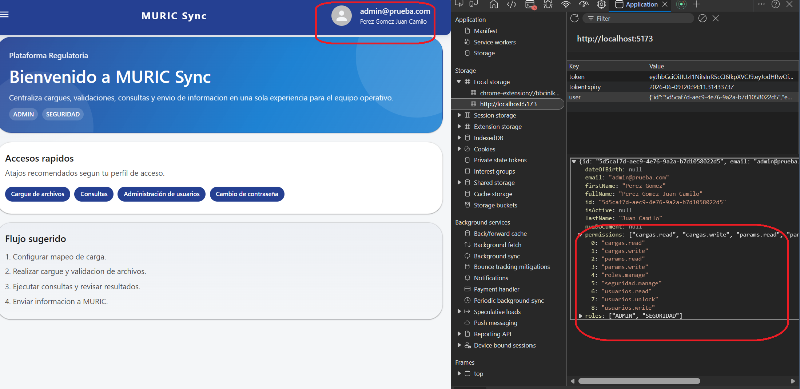

#### Estado CP01
  
🟢 Aprobado

---

### CP-RBAC-02 — Menú solo muestra ítems permitidos (ADMIN)

**Objetivo:**  
Verificar que el menú muestra todos los ítems para un ADMIN.

#### Pasos CP02

1. Inicia sesión con `admin@prueba.com`.  
2. Observa el menú lateral.  

#### Resultado esperado CP02

- Se muestran:  
  - Gestión de Roles  
  - Gestión de Permisos  
  - Reporte de Usuarios  
  - Parámetros de Seguridad  

#### Evidencias CP02

1. Menú lateral con nuevas opciones
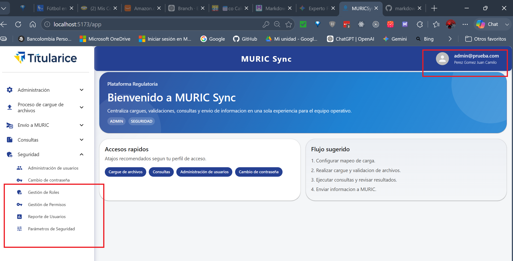

#### Estado CP02
  
🟢 Aprobado

---

## CP-RBAC-03 — Menú NO muestra ítems no permitidos (OPERADOR)

**Objetivo:**  
Verificar que el menú oculta ítems sin permiso.

### Pasos CP03

1. Inicia sesión con `operador@prueba.com`.  
2. Observa el menú lateral.  

### Resultado esperado CP03

- NO se muestran:  
  - Gestión de Roles  
  - Gestión de Permisos  
  - Reporte de Usuarios  
  - Parámetros de Seguridad  

#### Evidencias CP03

1. Menú lateral sin opciones no permitidas
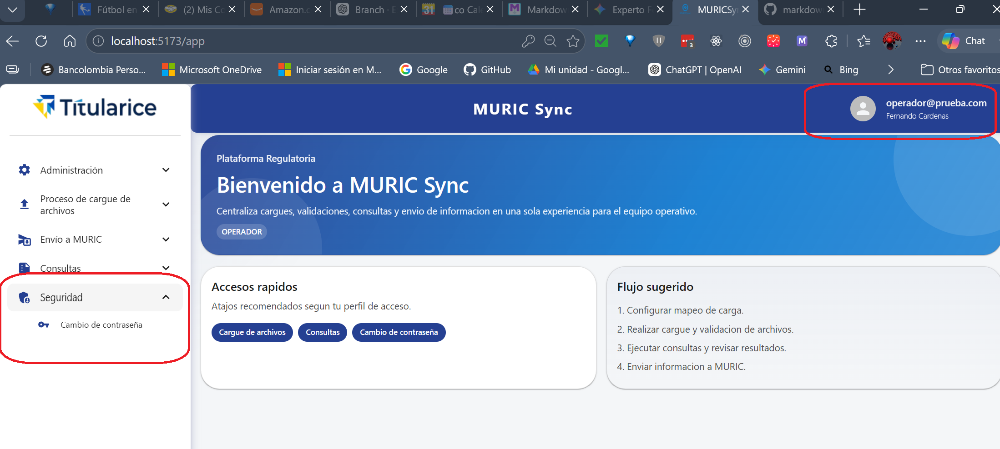

#### Estado CP03
  
🟢 Aprobado

---

## CP-RBAC-04 — Acceso directo a ruta sin permiso redirige

**Objetivo:**  
Verificar que navegar directamente a una ruta restringida redirige.

### Pasos CP04

1. Inicia sesión con `operador@prueba.com`.  
2. Navega directamente a `/app/lista-roles`.  
3. Repite para:  
   - `/app/lista-permisos`  
   - `/app/reporte-usuarios`  
   - `/app/config-seguridad`  

### Resultado esperado CP04

- En todos los casos, redirección automática a `/app`.  

#### Evidencias CP04

1. Navega directamente a `/app/lista-roles` redirección automática a `/app`.

2. Navega directamente a `/app/lista-permisos` redirección automática a `/app`.

3. Navega directamente a `/app/reporte-usuarios` redirección automática a `/app`.

4. Navega directamente a `/app/config-seguridad` redirección automática a `/app`.

#### Estado CP04
  
🟢 Aprobado

---

## CP-RBAC-05 — ListRoles carga y muestra roles correctamente

**Objetivo:**  
Verificar la pantalla de gestión de roles.

### Pasos CP05

1. Inicia sesión con `admin@prueba.com`.  
2. Navega a `/app/lista-roles`.  

### Resultado esperado CP05

- Se muestran los 4 roles predefinidos.  
- Cada fila muestra: nombre, descripción, estado, permisos, fecha.  
- Botones presentes: Editar, Permisos, Eliminar.  
- Botón “Nuevo rol” visible.  

#### Evidencias CP05

1. Se ven todos los registros y todas las columnas
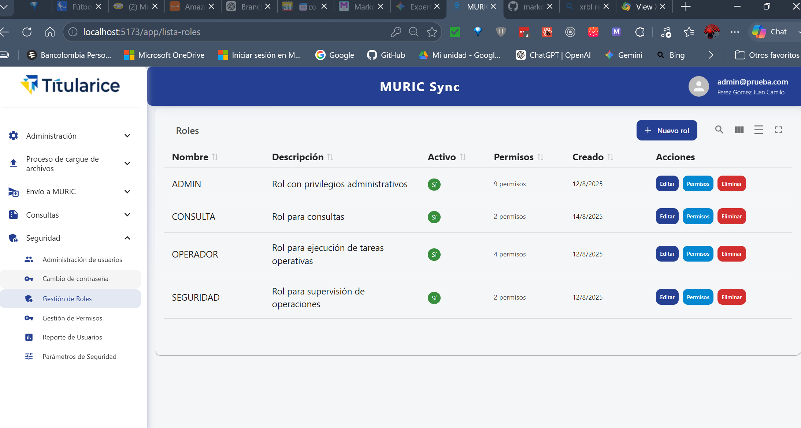

#### Estado CP05
  
🟢 Aprobado

---

## CP-RBAC-06 — Crear un nuevo rol

**Objetivo:**  
Verificar el flujo de creación de un rol.

### Pasos CP06

1. Haz click en “Nuevo rol”.  
2. Ingresa:  
   - Nombre: `TEST_ROLE`  
   - Descripción: `Rol de prueba`  
3. Haz click en “Guardar”.  

### Resultado esperado CP06

- El diálogo se cierra.  
- La tabla muestra `TEST_ROLE`.  
- El rol inicia con 0 permisos.  

#### Evidencias CP06

1. Diligenciar los datos del nuevo rol
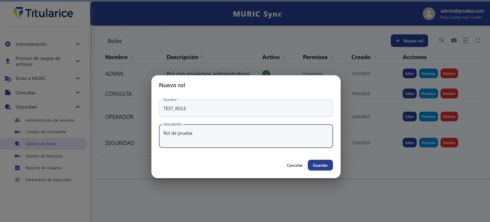
2. Nuevo Rol creado exitósamente
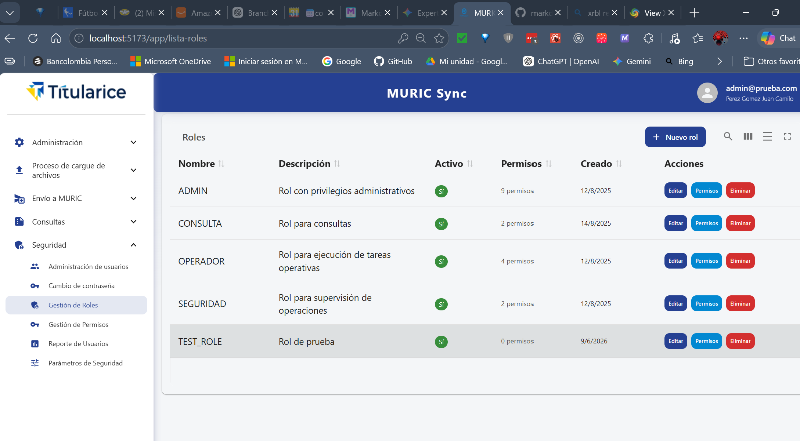

#### Estado CP06
  
🟢 Aprobado

---

## CP-RBAC-07 — Asignar permisos a un rol

**Objetivo:**  
Verificar el diálogo de asignación de permisos.

### Pasos CP07

1. En `TEST_ROLE`, haz click en “Permisos”.  
2. Marca: `params.read`, `cargas.read`.  
3. Haz click en “Guardar”.  

### Resultado esperado CP07

- La tabla muestra “2 permisos”.  
- Al reabrir el diálogo, los permisos marcados permanecen seleccionados.  

#### Evidencias CP07

1. Dialogo para asignar permisos exitoso
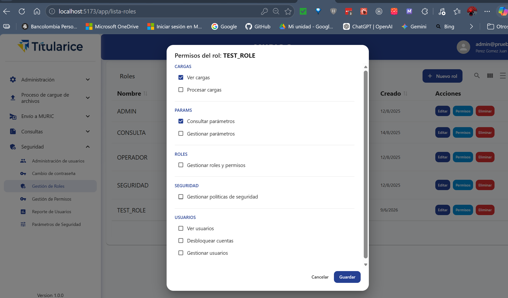
2. Resultado de la asignación exitoso
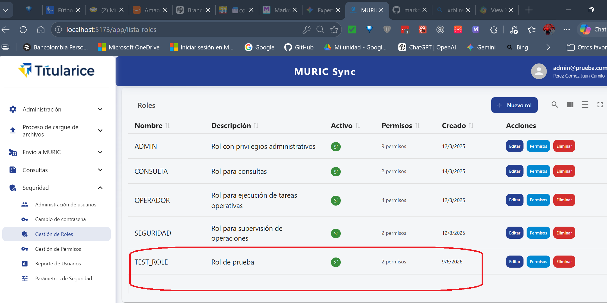

#### Estado CP07
  
🟢 Aprobado

---

## CP-RBAC-08 — Editar un rol

**Objetivo:**  
Verificar la edición de un rol.

### Pasos CP08

1. En `TEST_ROLE`, haz click en “Editar”.  
2. Cambia la descripción a `Rol de prueba modificado`.  
3. Guarda.  

### Resultado esperado CP08

- La descripción se actualiza en la tabla.  

#### Evidencias CP08

1. Dialogo para editar Roles
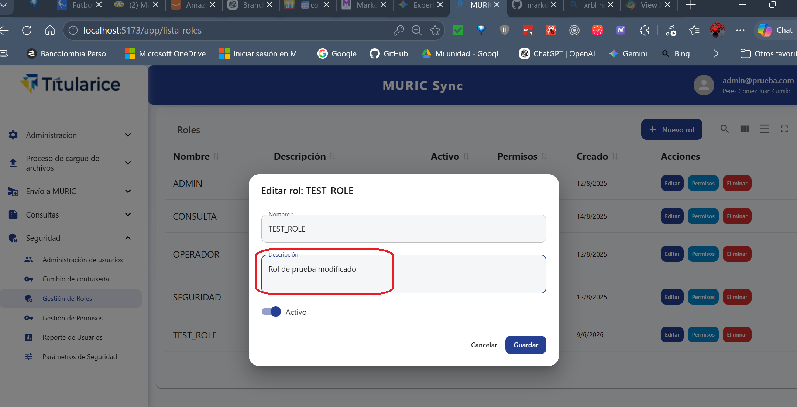
2. Rol modificado con éxito
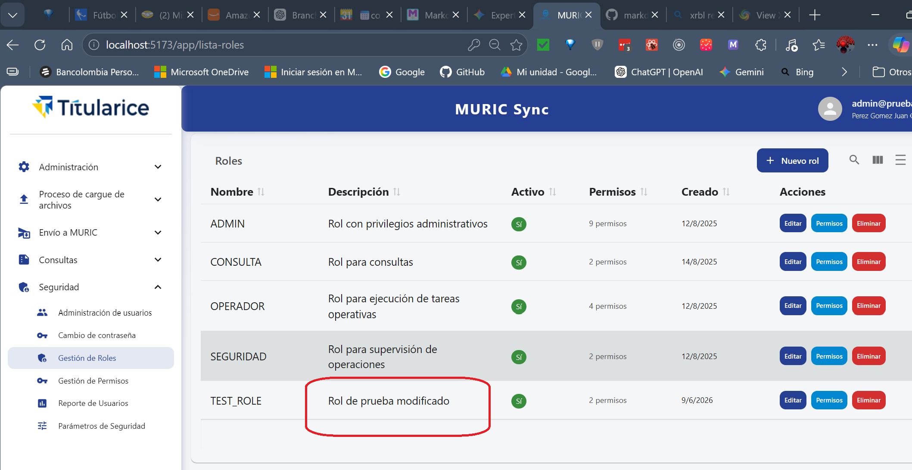

#### Estado CP08
  
🟢 Aprobado

---

## CP-RBAC-09 — Eliminar un rol sin usuarios

**Objetivo:**  
Verificar la eliminación de un rol.

### Pasos CP09

1. Asegúrate de que `TEST_ROLE` no tiene usuarios.  
2. Haz click en “Eliminar”.  
3. Confirma.  

### Resultado esperado CP09

- `TEST_ROLE` desapar

#### Evidencias CP09

1. Confirmación de borrado
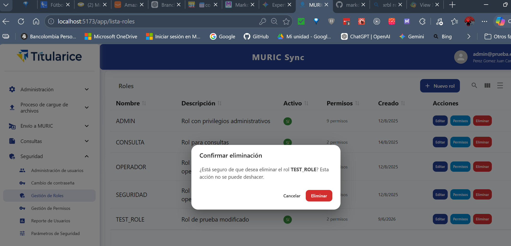
2. Lista de Roles sin `TEST_ROLE`
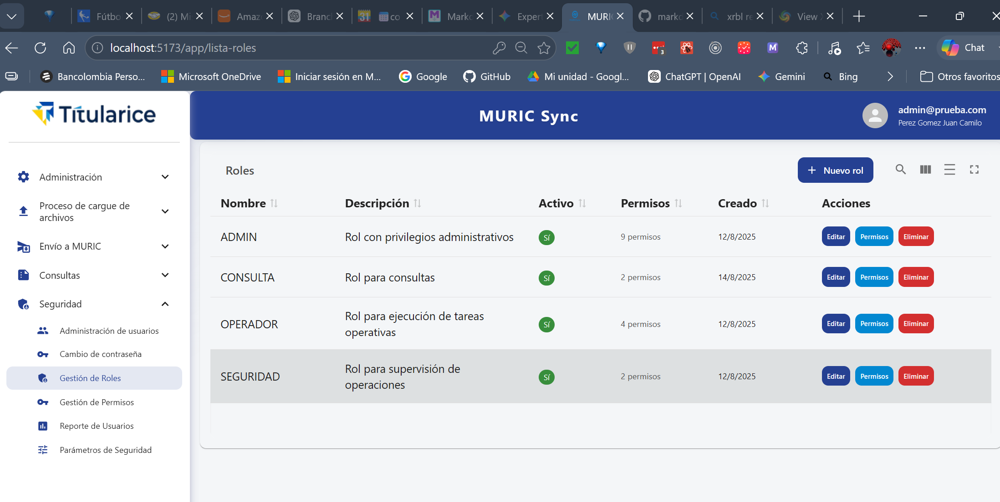

#### Estado CP09
  
🟢 Aprobado
ece de la tabla.  

---

## CP-RBAC-10 — Intentar eliminar un rol con usuarios asignados falla

**Objetivo:**  
Verificar que el backend rechaza la eliminación.

### Pasos CP10

1. Asegura que `OPERADOR` tiene usuarios.  
2. Haz click en “Eliminar”.  
3. Confirma.  

### Resultado esperado CP10

- Aparece mensaje de error.  
- El rol permanece en la tabla.  

#### Evidencias CP10

1. Rechazo de eliminación exitoso
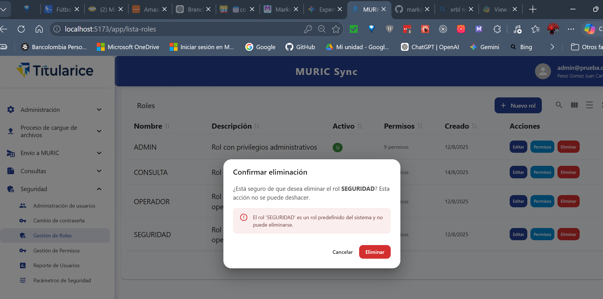

#### Estado CP10
  
🟢 Aprobado

---

## CP-RBAC-11 — Intentar eliminar un rol predefinido falla

**Objetivo:**  
Verificar la protección de roles predefinidos.

### Pasos CP11

1. En la fila de `ADMIN`, intenta eliminar.  

### Resultado esperado CP11

- Botón deshabilitado.  

#### Evidencias CP11

1. Evidencia RBAC11
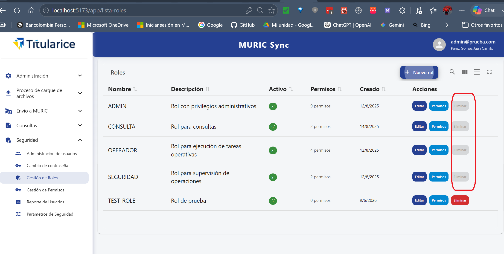

#### Estado CP11
  
🟢 Aprobado

---

## CP-RBAC-12 — ListPermissions carga y muestra permisos

**Objetivo:**  
Verificar la pantalla de permisos.

### Pasos CP12

1. Navega a `/app/lista-permisos`.  

### Resultado esperado CP12

- Se muestran los 9 permisos.  
- Cada fila muestra código, nombre, módulo, descripción.  
- Botones: Editar, Eliminar.  
- Botón “Nuevo permiso” visible.  

#### Evidencias CP12

1. Se muestran los nueve permisos con las funcionalidades completas
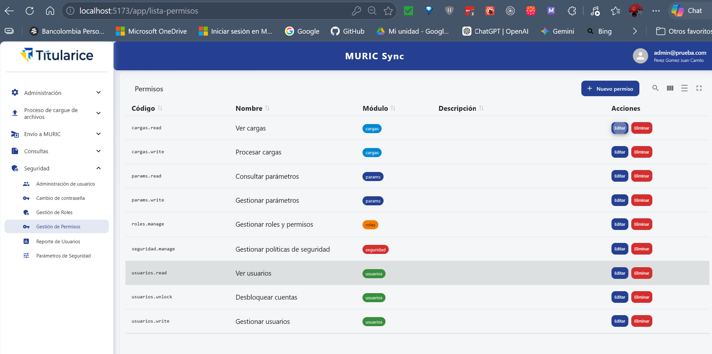

#### Estado CP12
  
🟢 Aprobado

---

## CP-RBAC-13 — Crear un nuevo permiso

**Objetivo:**  
Verificar creación de permisos.

### Pasos CP13

1. Haz click en “Nuevo permiso”.  
2. Ingresa:  
   - Código: `test.permission`  
   - Nombre: `Permiso de prueba`  
   - Módulo: `test`  
3. Guarda.  

### Resultado esperado CP13

- El permiso aparece en la tabla.  

#### Evidencias CP13

1. Dialogo para creación de permisos
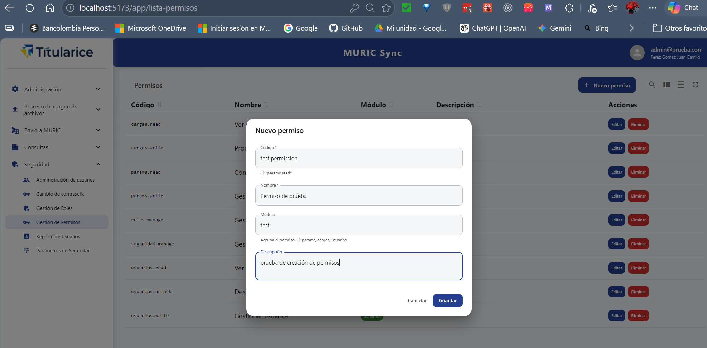
2. Lista de permisos muestra nuevo permiso
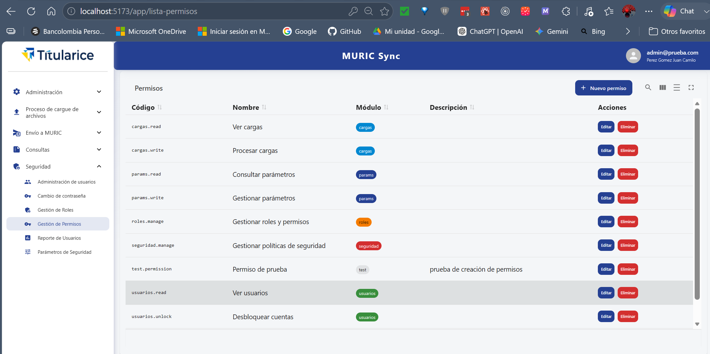

#### Estado CP13
  
🟢 Aprobado

---

## CP-RBAC-14 — El código del permiso es de solo lectura en edición

**Objetivo:**  
Verificar que el código no se puede modificar.

### Pasos CP14

1. Edita `test.permission`.  

### Resultado esperado CP14

- El campo “Código” está deshabilitado.  

#### Evidencias CP14

1. Se ve el código deshabilitado.
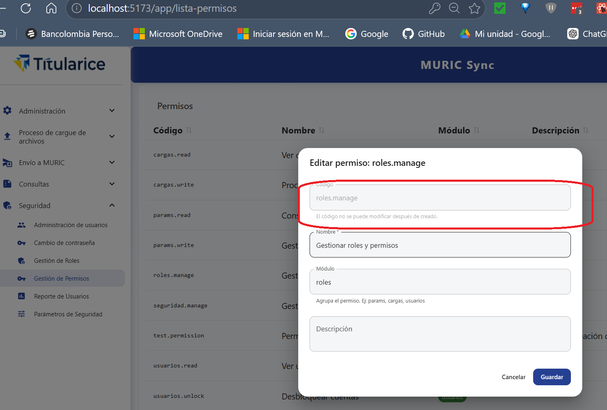

#### Estado CP14
  
🟢 Aprobado

---

## CP-RBAC-15 — Eliminar permiso sin roles asignados

**Objetivo:**  
Verificar eliminación sin dependencias.

### Pasos CP15

1. Asegura que `test.permission` no está asignado.  
2. Elimínalo.  

### Resultado esperado CP15

- El permiso desaparece de la tabla.  

#### Evidencias CP15

1. Evidencia RBAC15

#### Estado CP15
  
🟢 Aprobado

---

## CP-RBAC-16 — Intentar eliminar permiso con roles asignados falla

**Objetivo:**  
Verificar protección de integridad.

### Pasos CP16

1. Intenta eliminar `params.read`.  

### Resultado esperado CP16

- Error indicando que tiene roles asignados.  
- El permiso permanece.  

#### Evidencias CP16

1. Evidencia RBAC16

#### Estado CP16
  
🟢 Aprobado

---

## CP-RBAC-17 — Código de permiso duplicado es rechazado

**Objetivo:**  
Verificar validación de unicidad.

### Pasos CP17

1. Crear permiso con código `params.read`.  

### Resultado esperado CP17

- Backend rechaza.  
- Frontend muestra error.  

#### Evidencias CP17

1. Evidencia RBAC17

#### Estado CP17
  
🟢 Aprobado

---

# Pruebas de Regresión

---

## CR-RBAC-01 — Funcionalidad existente no se rompe

### Pasos

1. Inicia sesión con `operador@prueba.com`.  
2. Navega a `/app/lista-tipo-credito`.  
3. Navega a `/app/carga-archivos`.  

### Resultado esperado

- Ambas pantallas funcionan sin errores.  

---

## CR-RBAC-02 — Login/Logout funciona correctamente

### Pasos

1. Login con `admin@prueba.com`.  
2. Logout.  
3. Login nuevamente.  

### Resultado esperado

- Flujo completo sin errores.  

---

Si quieres, puedo generar también:

- una **plantilla oficial de QA** para todos los sprints  
- una versión con **tablas para pasos/resultados**  
- una versión con **IDs automáticos y numeración**  
- una versión con **secciones colapsables pero sin HTML** (usando trucos de Markdown extendido)

Solo dime cuál prefieres.